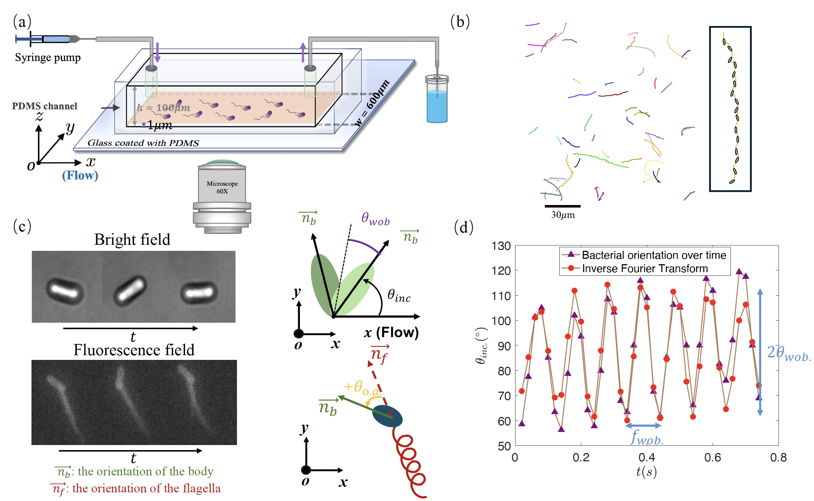

 
  **Bacterial wobbling in shear flow**

 - Bacteria commonly inhabit in flowing environments, where fluid dynamics play a crucial role in shaping their motion. Among the key factors influencing bacterial locomotion, gait has gained increasing attention due to its essential role in facilitating movement. While the effects of gait, particularly wobbling, have been extensively examined in static environments, its role in flow conditions remains less explored. 
 -   
 - Here, my project is to observe wobbling changes in angle and frequency under flow conditions, which leading to a pronounced impact on bacterial speed. When a constant flow is maintained, bacteria experience varying forces depending on their orientation, which plays a key role in determining their wobbling angle. Beyond the off-axis angle, bacterial morphology, specifically body length, also plays a role in influencing wobbling in shear flow. Our findings provide new insights into bacterial morpgology and gait near surfaces in shear flow, contributing to a better understanding of bacterial motion in dynamic environments.
 - How to wobble in active flow generated by collective bacteria.

