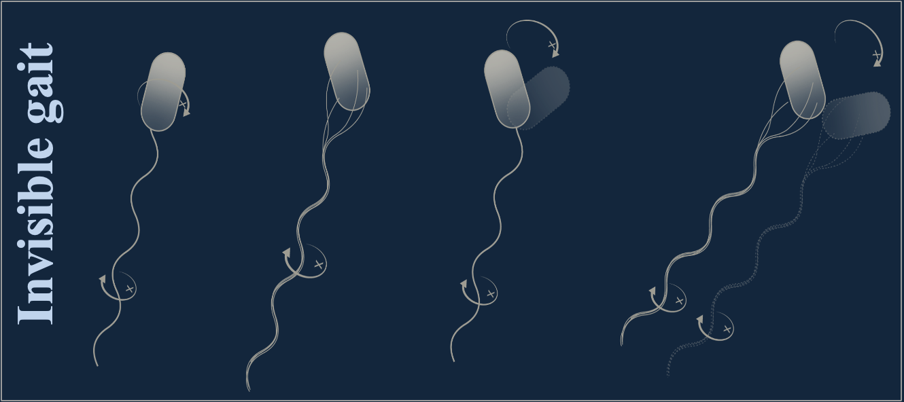

As a PhD student and research assistant in the School of Physics at the SMPL laboratory, my research focuses on elucidating the versatile swimming patterns of _Escherichia coli_ driven by its flagellar bundle, aiming to uncover the micro-gaits influenced by flagellar morphology and environmental conditions. By developing a comprehensive framework to study variations in flagellar shape, number, and inter-flagellum spacing, this project employs an advanced 3D tracking system with three-degree-of-freedom orientation analysis to capture detailed swimming dynamics of the bacterial body rod. The study investigates how these micro-gaits adapt across diverse fluid environments, boundary conditions, and bacterial phenotypes during growth and division. This work seeks to reveal the biomechanical principles governing _E. coli_ motility, offering novel insights into bacterial navigation, adaptation, and infection mechanisms, with potential applications in microbial control, synthetic biology, and the design of bioinspired micro-robots.
