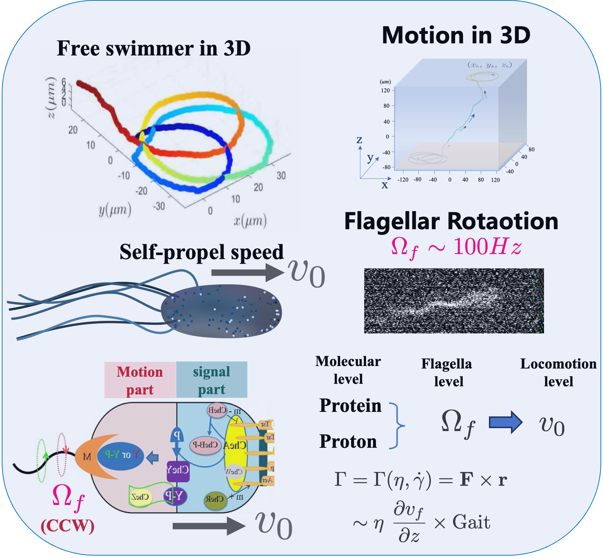

**Flow sensing of bacterial flagellum motor**

In low Reynolds number environments, bacterial swimming is governed by viscous hydrodynamics, where flagellar motors drive helical flagella to propel cells through dynamic flows. While hydrodynamic models explain passive responses to fluid forces, whether bacteria actively sense and adapt to flow variations with biological functions—such as chemotaxis or behavioral modulation—remains elusive. This gap stems from the challenge of accurately measuring bacterial dynamics during active swimming, as traditional microscopy lacks the spatiotemporal resolution to capture three-dimensional (3D) motion and flagellar responses in complex flow fields.  My project addresses this by leveraging our newly developed multiple degree of freedom (DoF) tracking system to reveal how bacterial flagellar motors sense, respond, and adapt to dynamic flows.

